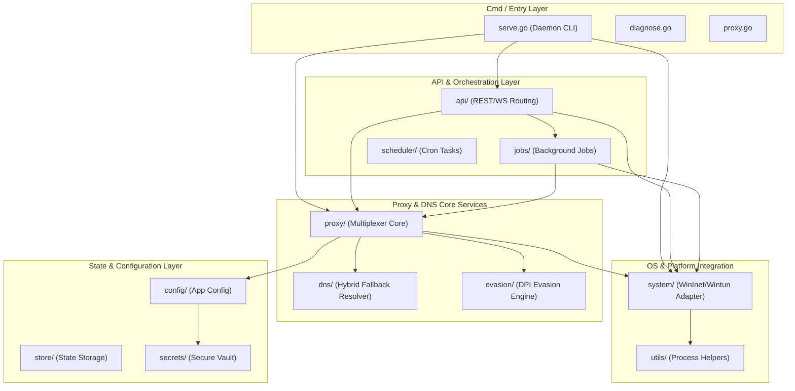

# Design

## Scope and authority
- Status: Active product and interaction intent.
- Visual token and component authority: [`governance/design-system/MASTER.md`](governance/design-system/MASTER.md).
- Compatibility source material: `governance/design-system/legacy.md`; do not copy its
  tokens directly into new work until they are reconciled with the canonical master.
- Last refreshed: 2026-07-15
- Primary product surfaces: Desktop GUI (Frontend), CLI, and Background Service.
- Evidence reviewed: `src/packages/control-ui/src/` (Tailwind v4 integration), `src/packages/lumicore/` (high-performance Rust core), `src/apps/daemon/` (Go background).

## Brand
- Personality: High-performance, secure, highly technical, utilitarian, and precise. (Reference: "Sovereign Glass Command Cockpit")
- Trust signals: Real-time telemetry, explicit security states, and minimal bloat.
- Avoid: Emojis as icons, overly playful aesthetics, consumer-focused fluff, generic corporate themes, and heavy JavaScript animations that imply slowness.

## Product goals
- Goals: Provide an unblockable, high-performance, and stealthy network proxy and security layer across Windows and mobile.
- Non-goals: Social features, generalized web browsing, or heavy multi-media streaming management.
- Success signals: Minimal latency overhead, zero UI jank, and complete transparency of network rules.

## Personas and jobs
- Primary personas: Power users, security researchers, and developers in restrictive network environments.
- User jobs: Bypass network censorship, monitor application traffic, and secure DNS/TCP flows.
- Key contexts of use: Background persistent operation with occasional dense configuration/monitoring via the dashboard.

## Information architecture
- Primary navigation: Left-hand collapsible sidebar.
- Core routes/screens: Dashboard (telemetry), Rules/Routing, DNS/Security, Logs, Settings.
- Content hierarchy: Active connection status > Bandwidth graphs > Detailed logs > Configuration.

## Design principles
- Principle 1: Information density over whitespace. Power users want to see data, not padding.
- Principle 2: Feedback must be immediate (e.g., connection state changes, latency metrics).
- Tradeoffs: Complexity is acceptable if it provides control; we do not hide advanced settings behind "simple" modes unless necessary.

## Visual language
- Color: Deep dark mode (`oklch(0.15 0.05 250)`) with high-contrast semantic highlights (electric blue `oklch(0.6 0.2 250)`, success green, warning amber, error red).
- Typography: System sans-serif for UI (`Outfit` or `Inter`). Strict `monospace` (with tabular numerals) for IPs, ports, latencies, and logs.
- Spacing/layout rhythm: Compact and utilitarian. Use Tailwind v4 spacing tokens.
- Shape/radius/elevation: Sharp, technical edges (`--radius-md`). Borders (`border-white/10`) preferred over deep shadows to keep it flat and fast.
- Motion: Instantaneous state changes. Micro-animations only for critical feedback.
- Imagery/iconography: Utilitarian SVG icons (e.g., Lucide or Heroicons). No decorative illustrations.

## Components
- Existing components to reuse: Custom Tailwind v4 utility-based components in `src/packages/control-ui`.
- New/changed components: Real-time telemetry charts, dense data tables for connections.
- Variants and states: Strict hover (`hocus`) states on all interactive elements. Disabled states must clearly indicate why.

## Accessibility
- Target standard: WCAG 2.1 AA (focused on contrast for dark mode).
- Keyboard/focus behavior: Full keyboard navigability for power users. Visible focus rings (`focus-visible:ring-2`).
- Contrast/readability: High contrast text on dark backgrounds.
- Reduced motion and sensory considerations: Motion is already minimal.

## Responsive behavior
- Supported breakpoints: Desktop-first (`md` and `lg` primary). Mobile support for basic monitoring if ported.
- Layout adaptations: Sidebar collapses to icons on smaller screens. Data tables gain horizontal scroll.

## Interaction states
- Loading: Skeleton loaders for initial data, subtle inline spinners for ongoing background tasks.
- Empty: "No active connections" or "No rules defined" with a clear CTA to add one.
- Error: Inline error banners for failed connections (e.g., "DNS resolution failed").
- Success: Subtle toast notifications for saved configurations.
- Disabled: Low opacity (50%), `cursor-not-allowed`.

## Content voice
- Tone: Objective, technical, and precise.
- Terminology: Standard networking terms (TCP, UDP, SNI, DoH). Do not dumb down terms.
- Microcopy rules: Use exact numbers (e.g., "Timeout in 3000ms" rather than "Takes a while").

## Implementation constraints
- Framework/styling system: React + Vite + Tailwind CSS v4 (CSS-first `@theme`).
- Performance constraints: UI must not block or lag during high-throughput network events. Use virtualized lists for massive connection logs.
- Test/screenshot expectations: UI must render deterministically for Visual Ralph and Playwright audits.

## Open questions
- [ ] Will we support a light mode, or is dark mode forced? (Assuming dark mode forced for now).
- [ ] Do we need a dedicated "Mobile UI" layout, or just responsive desktop?

## Architectural Topology

