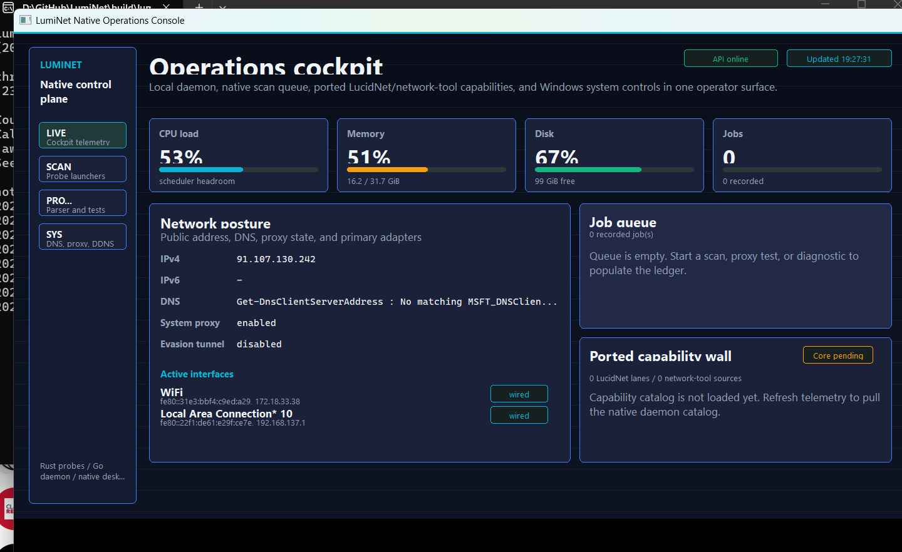
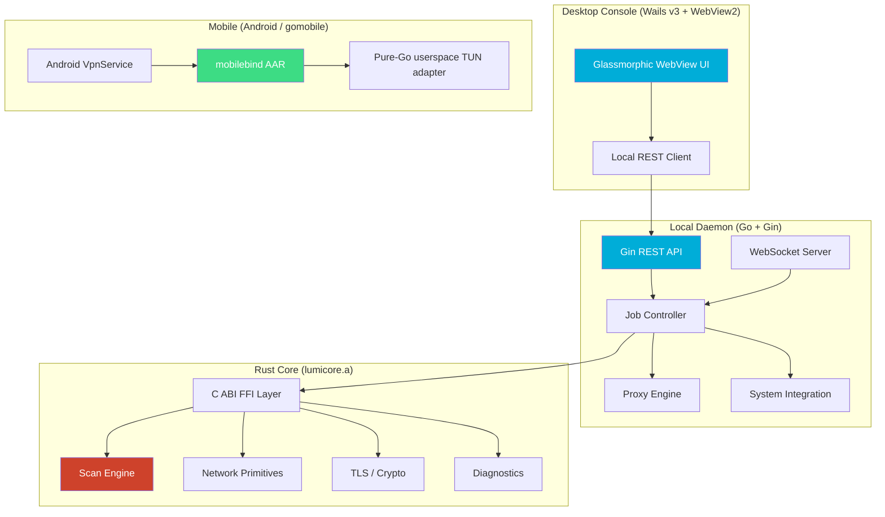

<div align="center">

# 🌐 LumiNet

### Native Network Operations Console

*A high-performance, multi-language network diagnostic, scanning, proxy testing, and system management platform.*

> **Documentation status:** [the current-system manual](docs/current-system.md)
> is the sole authority for implemented, degraded, and unavailable behavior.
> The subsystem inventory below is retained as historical design and research
> material; it must not be read as a supported-capability contract.

[](https://www.rust-lang.org/)
[](https://go.dev/)
[](LICENSE)

---

**Illuminate Your Network**

[Current System](docs/current-system.md) · [Quick Start](docs/guides/quickstart.md) · [Product Intent](PRODUCT.md) · [API Routes](docs/api/current-routes.md) · [CLI Reference](docs/guides/cli-reference.md) · [Design System](DESIGN.md)

</div>

---

## ✨ Overview

LumiNet is a local network dashboard, proxy testing suite, and system configuration cockpit designed for power users, developers, and privacy-conscious researchers operating in restricted or monitored network environments. Built with a high-performance Rust scanning engine (`lumicore`) linked statically into a Go daemon, it provides transparent, raw network instrumentation without relying on external cloud databases or paid SaaS dependencies.



---

## 🚀 Key Subsystems & Features

### 🔍 1. LumiScan — High-Performance Scanning
*   **ICMP Sweep:** Concurrent subnet sweep utilizing high-precision async sockets. Includes rate limiting, adaptive timeouts, and raw RTT calculations.
*   **TCP Port Sweep:** Discovers open ports, issues raw socket connect checks, and performs service banner grabbing (parsing SSH headers, HTTP Server banners, SSL fingerprints).
*   **DNS Record Harvesting:** Retrieves records (`A`, `AAAA`, `CNAME`, `MX`, `TXT`, `NS`) from multiple recursive resolvers simultaneously.
*   **TLS Certificate Inspector:** Initiates standard TLS handshakes, parses the remote certificate chain, checks expiration, evaluates certificate trust paths, and lists supported SSL/TLS cipher suites.
*   **SNI Reachability Probe:** Sends a custom ClientHello containing a target Server Name Indication (SNI) header to verify if local firewalls filter the domain.

### 🛡️ 2. LumiGuard — Integrity Auditing & Detection
*   **DNS Poisoning Detector:** Queries hostnames via standard UDP (port 53) and encrypted DNS-over-HTTPS (DoH) side-by-side to identify local DNS hijacking.
*   **Man-in-the-Middle (MITM) Auditor:** Evaluates SSL certificate issuers during HTTPS handshakes against local trust roots. Flags instances where known enterprise SSL decryption firewalls have intercepted connection packets.
*   **Forced SafeSearch Redirection Auditor:** Automatically inspects DNS resolutions for major search engines (Google, Bing, YouTube) and alerts the user of gateway CNAME redirection filtering.
*   **Windows NCSI Overrides:** Allows users to override active Windows Network Connectivity Status Indicator (NCSI) registry keys to bypass fake "No Internet Access" indicators caused by local ISP blockages of Microsoft's validation domains.
*   **CAPTCHA Bypass Integration:** Integrates 2Captcha APIs to extract sitekeys (`SITEKEY`) from Cloudflare Turnstile, hCaptcha, and Google reCAPTCHA challenges encountered during proxy subscription downloads.
*   **SOCKS5 UDP Associate NAT Mapper:** Employs UDP mapping diagnostics for gaming consoles and STUN servers. Bridges incoming SOCKS5 UDP packets, maintaining a 120-second active NAT translation state to avoid session disconnects over strict firewall gates.

### ⚡ 3. Active Evasion & Circumvention Layers
The active evasion suite manipulates TCP packets and streams in user-space to bypass DPI firewalls:
*   **TCP Segment Splitting & Delay:** Slices initial connection streams at custom byte boundaries (e.g., offset 3) and delays subsequent segments by a configurable interval (in milliseconds) to interrupt signature extraction.
*   **Auto-Split TLS SNI (Smart Evasion):** Strips the TLS ClientHello header, parses SNI extensions automatically, and splits the TCP segment exactly at the SNI payload string boundary, preventing signature-matching engines from parsing hostnames.
*   **Userspace Raw Handshake Injection (paqet mode):** Bypasses the standard OS TCP 3-way handshake to prevent tracking. Injects custom `PSH-ACK` buffers via raw sockets. Uses `AF_PACKET` on Linux; on Windows the same mode requires an operator-supplied WinDivert runtime, which is not bundled with LumiNet. If that dependency is unavailable, packet-injection startup fails closed.
*   **Plaintext HTTP Header Mutation:** Mutates standard headers (e.g. `Host: google.com` -> `hOsT: google.com` or `Host  : google.com`) to cause deep packet parsing failures in legacy firewalls.
*   **Range-Based Fragmentation:** Divides outgoing packets into random chunk sizes (between `minLength` and `maxLength`) with a customizable write delay (`delayMs`) to randomize traffic fingerprints.

### 🌐 4. Outbound Connection Wrappers
*   **Netrix KCP Performance Profiles:** Predefined, runtime performance optimization profiles (`balanced`, `aggressive`, `latency`, `cpu-efficient`) mapped directly to KCP transport setups.
*   **Netrix Obfuscated Stream:** Employs a custom KCP connection wrapper (`NetrixConn`) that compresses stream data frames using LZ4 or Zstandard block framing compression and introduces random timing jitter to scramble fingerprint signatures.
*   **DNS Active Resolver Scanner:** Audits recursive DNS servers by initiating parallel DNS queries containing random subdomains targeting destination resolvers. This forces recursive servers to forward queries to authoritative nodes rather than answering from cache, validating end-to-end DNSTT/Slipstream path latency and availability.
*   **Covert Telemetry IP Tracker:** Serves dynamic decoy HTTP web pages for unauthenticated scanner hits. Logs incoming visit events in SQLite databases (`covert_links` and `covert_visits`), capturing telemetry metrics (User-Agent header parsed into OS/browser/device type classifications, client IP, and GeoIP metadata). Exposes CRUD endpoints (`/api/system/covert`) protected by secure API headers to manage links and inspect visit metrics.
*   **Zephyr Google Drive Transport:** Bridges outbound proxy connections over Google Drive file uploads. Clients write connection data into structured files and poll GDrive directories to retrieve responses. It optionally wraps connection frames in binary envelopes prepended with MagicBytes (`0x1F`), SessionID, Sequence, and payload length descriptors.
*   **Dijkstra Multi-Hop Pathfinder:** Employs Dijkstra's shortest-path algorithms to resolve the lowest-latency multi-hop proxy chains dynamically across the active relay node mesh.
*   **UptimeFlare Health Checks:** Periodically probes target TCP endpoints and HTTP URLs in background loops to maintain latency and availability histories in-memory.
*   **Dynamic Phishing Domain Filters:** Checks target destinations against domain blacklist APIs with local memory caching to block malicious traffic at the rules level.

---

## 🗂️ Source Layout

All live source is under [`src/`](src/). Applications live in `src/apps/`; reusable/shared modules live in `src/packages/`. The daemon's internal packages are grouped by dependency depth (`foundation/native → protocols/platform → networking → analysis/integrations → runtime → workflows → adapters`), and repository verification rejects upward cross-band imports.

Every meaningful source folder contains a `.context` file with its purpose, direct contents, interface/dependencies, and invariants. Start at [`src/.context`](src/.context) and follow child contexts when navigating unfamiliar code. Generated/copied UI output and Android resource folders are documented by their parent context instead of receiving files that could change packaged artifacts. See [Repository Layout Contract](docs/architecture/repository-layout.md) and [ADR-0015](docs/adr/0015-organize-live-source-under-src-and-dependency-bands.md).

---

## 🏗️ Architecture

LumiNet compiles to a statically linked multi-language application:



> **Native/mobile boundary:** Supported host daemon builds may link the Rust static core through CGO. Rust implementations are checked against the private Go declaration surface `src/apps/daemon/internal/native/bridge/lumicore_abi.h`, and Cargo supplies native link requirements. Android does **not** use that host Rust-CGO path: `VpnEngineService` transfers the TUN descriptor to the generated `mobilebind` AAR, which runs the real pure-Go `CoreController -> mobilehost.StartTun2SocksWithDNS` data plane. The shared React UI lives in `src/packages/control-ui` and is embedded by both daemon and Wails desktop.

For current ownership and capability status, see the [Current-System Manual](docs/current-system.md).

---

## 📱 Supported Platforms

| Platform | Binary | Notes |
|:---|:---|:---|
| **Windows** (amd64) | `luminet.exe` + `watchdog.exe` + `luminet-desktop.exe` | Wails v3 + WebView2 desktop host included; WinDivert-backed raw packet modes require an external operator-supplied WinDivert runtime |
| **Linux** (amd64) | `luminet` + `watchdog` + `luminet-desktop` | CLI daemon + WebView desktop |
| **macOS** (amd64 / arm64) | `luminet` + `watchdog` + `luminet-desktop` | CLI daemon + WebView desktop |
| **Android** | `luminet.aar` + `luminet-android-unsigned.apk` | generated mobilebind library plus linked **unsigned** release APK; sign externally before distribution |

---

## 🛠️ Build from Source

### Prerequisites
Host daemon builds use CGO to link the Rust core and require a compatible C compiler toolchain. Android AAR/APK builds use the pure-Go mobile bridge and do not inherit the host Rust-CGO link boundary.

*   **Windows:** Install [MSYS2](https://www.msys2.org/) and execute: `pacman -S mingw-w64-x86_64-gcc`
*   **Linux:** Install via apt: `sudo apt install build-essential`
*   **macOS:** Install Xcode Command Line Tools: `xcode-select --install`

### Compilation Commands
```bash
# Clone the repository
git clone https://github.com/maybeknott/luminet.git
cd LumiNet

# Windows Compilation (PowerShell)
.\scripts\build-all.ps1

# Unix Compilation (Linux / macOS)
chmod +x scripts/build-all.sh
./scripts/build-all.sh

# Android Mobile Library (requires gomobile + Android NDK)
chmod +x scripts/mobile_bind.sh
./scripts/mobile_bind.sh
```

---

## 💻 Documentation Index

For details on configuration and development, consult the guides listed below:

*   **[Quick Start Guide](docs/guides/quickstart.md)** — Installation, CLI examples, daemon configurations.
*   **[Developer & Technical Manual](docs/guides/development.md)** — ABI boundaries, compilation troubleshooting, evasion tunnel mechanics.
*   **[Desktop Console](src/apps/desktop/README.md)** — Wails v3 WebView2 desktop shell and session-discovery interface.
*   **[CLI Reference Manual](docs/guides/cli-reference.md)** — Detailed flags and usage examples for all subcommands.
*   **[Architecture Overview](docs/architecture/overview.md)** — System architecture, runtime flows, and subsystem design.
*   **[Product Specification](PRODUCT.md)** — System requirements, pillars, and target personas.
*   **[Design System](DESIGN.md)** — Styling tokens, CSS patterns, "Sovereign Glass Command Cockpit" aesthetic.
*   **[Build & Toolchains](docs/guides/building.md)** — Cross-platform build instructions and CI/CD pipeline.
