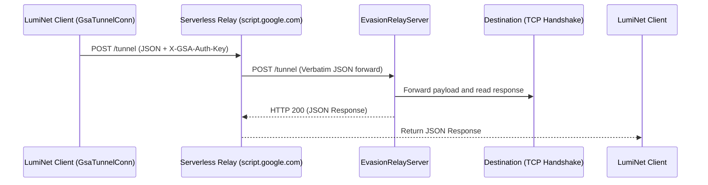

# LumiNet Serverless Covert Relays

This directory contains serverless egress relay scripts for **Google Apps Script** and **Cloudflare Workers**. These relays act as censorship-resistant domain-frontable proxies that forward encrypted packet sessions from the client (`GsaTunnelConn`) to the `EvasionRelayServer` `/tunnel` endpoint.

## Architecture Overview



Since the client only communicates directly with the trusted domains (`script.google.com` or `workers.dev`), DPI filters and network blockages targeting the actual proxy infrastructure are completely bypassed.

---

## 1. Google Apps Script Relay Deployment

### Deployment Steps:
1. Go to the [Google Apps Script Dashboard](https://script.google.com/).
2. Click **New project** and delete any placeholder code.
3. Open [google_apps_script.js](google_apps_script.js) from this folder and copy the contents into the editor.
4. Modify the `CONFIG` object variables:
   * **`AUTH_KEY`**: Set a secure secret key (must match the `CovertGsaKey` on the client side).
   * **`RELAY_URL`**: Enter the public URL of your `EvasionRelayServer`'s `/tunnel` endpoint (e.g. `https://your-relay-server.com/tunnel`).
5. Click **Deploy** -> **New deployment**.
6. Select **Web app** as the deployment type:
   * **Execute as**: `Me` (your Google account).
   * **Who has access**: `Anyone` (this enables public API incoming POST calls).
7. Copy the generated **Web App URL** (e.g., `https://script.google.com/macros/s/AKfycb.../exec`).

---

## 2. Cloudflare Worker Egress Relay Deployment

### Deployment Steps:
1. Install Wrangler and authenticate with Cloudflare (`npx wrangler login`).
2. From the repository root, deploy the bundled worker with `npx wrangler deploy --config deploy/relays/cloudflare/wrangler.toml`.
3. The bundle routes `/relay` to [cloudflare_worker.js](cloudflare_worker.js) and includes the shared fixed-target relay contract from `deploy/relays/fixed_http_contract.mjs`; do not paste the module alone into the dashboard.
4. Go to **Settings** -> **Variables** in your worker dashboard and define environment variables:
   * **`AUTH_KEY`**: Set your pre-shared authentication key.
   * **`RELAY_URL`**: Set the destination `EvasionRelayServer` `/tunnel` endpoint.
5. Optionally set **`RELAY_MAX_HOPS`** and **`MAX_BODY_BYTES`** to enforce the shared contract limits.
6. Copy the worker’s public route URL (e.g., `https://covert-relay.your-subdomain.workers.dev`).

---

## 3. Client Evasion Tunnel Configuration

Update your client configuration JSON to route connections through these relays:

```json
{
  "covert_mode": "gsa",
  "covert_gsa_url": "https://script.google.com/macros/s/AKfycb.../exec",
  "covert_gsa_key": "your-configured-auth-key"
}
```
