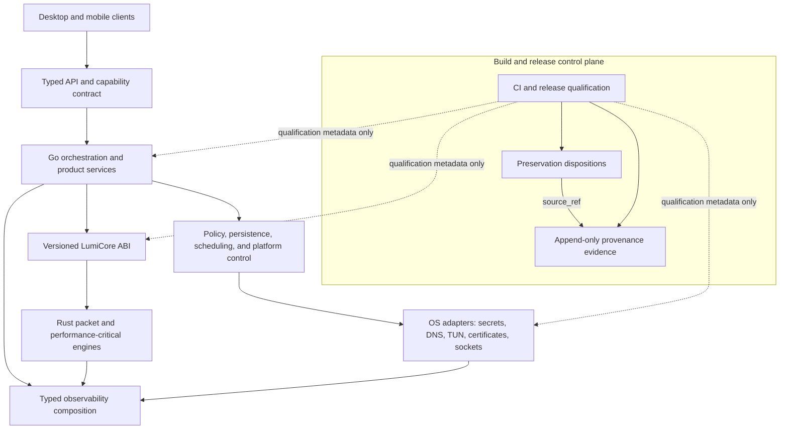
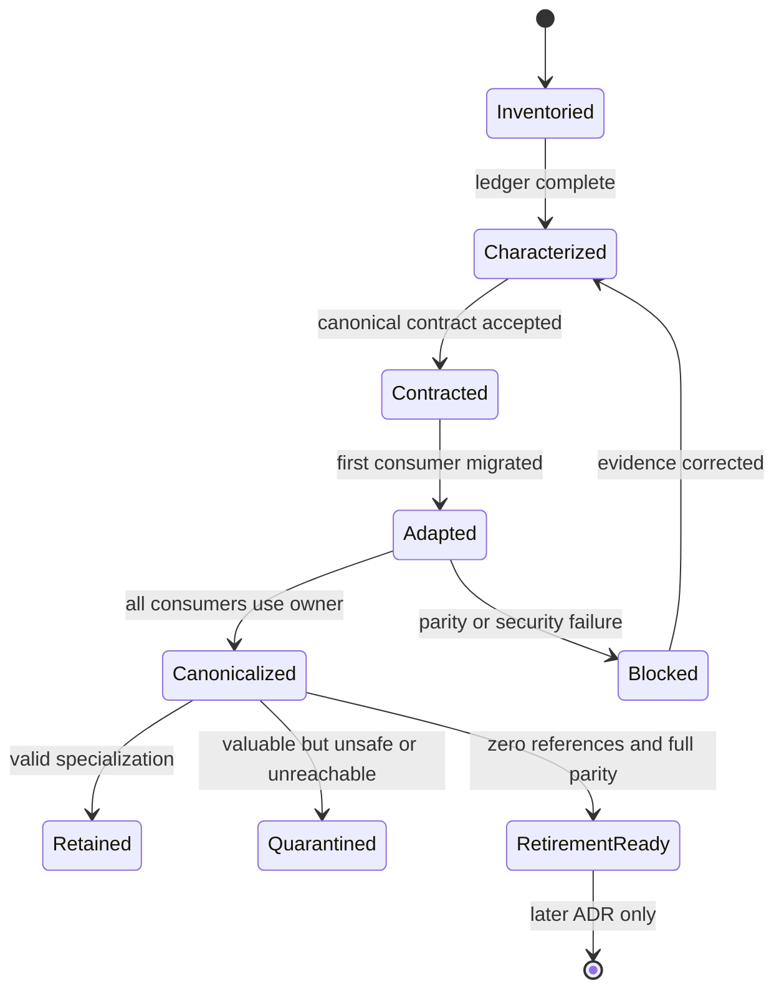
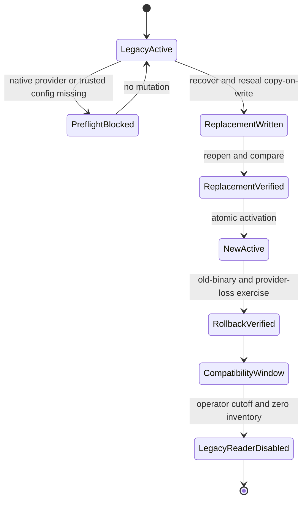
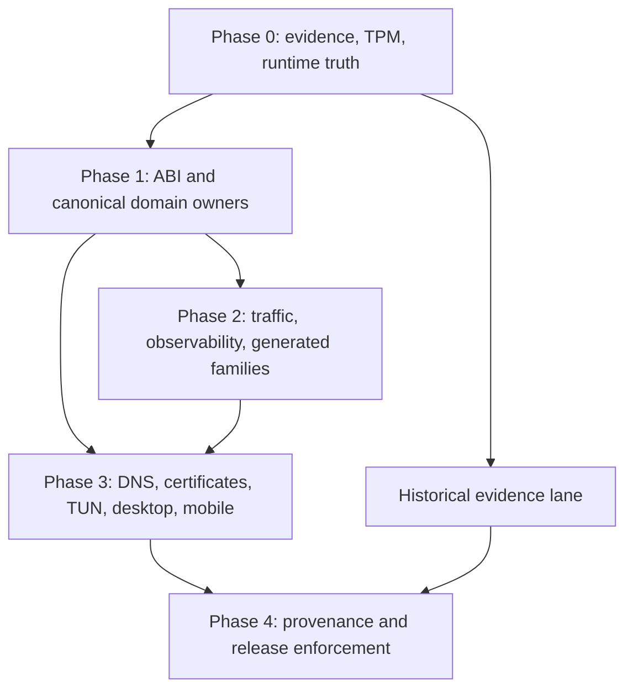

# LumiNet Lossless Consolidation and Production Recovery Roadmap - Plan

## Goal Capsule

| Field | Contract |
|---|---|
| Objective | Turn LumiNet's overlapping implementations into explicit canonical services, policies, adapters, and platform specializations without losing peer-only behavior or historical provenance. |
| Authority | Session-settled decisions in this plan override older roadmap text; live repository evidence overrides historical claims; preservation-ledger evidence governs any future retirement. |
| Execution profile | Deep, phased refactor program with 23 dependency-ordered implementation units and reversible release gates. |
| Immediate starting point | Close the preservation-ledger enforcement and TPM/native-secret production gaps before expanding network-facing consolidation. |
| Deletion rule | No generated family, wrapper, porting shell, or historical artifact is deleted in this program merely because it is duplicated, unused, incomplete, or low-quality. |
| Stop condition | Stop a unit when behavior cannot be characterized, a security boundary is unresolved, an ABI or platform contract is ambiguous, or a proposed replacement cannot prove preservation of accepted peer value. |
| Tail ownership | The executing agent or team owns characterization, implementation, verification, rollback evidence, and cleanup of abandoned attempts; the plan file remains a decision artifact and is not used as a progress tracker. |

---

## Product Contract

### Summary

LumiNet will converge on one owner per product domain while retaining legitimate protocol, platform, data-plane, and diagnostic specializations behind explicit contracts.
The program uses preservation-led migration: inventory peers, record every useful detail, define the canonical contract, characterize old behavior, migrate consumers through adapters, prove equivalence or superiority, and only then prepare a separate retirement decision.
Product recovery and historical reconstruction proceed as coordinated lanes so runtime truth and porting claims become reproducible together.

### Problem Frame

The repository contains overlapping runtime services, generated variant matrices, hand-maintained ABI surfaces, duplicated platform integrations, and historical porting claims with mixed authority.
Some peers are near-clones, some are distinct layers with misleadingly similar names, and some are valuable design intent trapped in unreachable or log-only shells.
Flattening these indiscriminately would erase behavior; preserving all of them indefinitely would perpetuate drift, false capability claims, security gaps, and packaging ambiguity.
The program must therefore distinguish canonical ownership, composition, extracted primitives, valid specialization, quarantine, and evidence-qualified retirement.

### Actors

- A1. Maintainer — implements and reviews canonical contracts, adapters, characterization tests, and ledger dispositions.
- A2. Operator — configures production security boundaries, performs TPM migration and rollback, and receives actionable non-secret diagnostics.
- A3. Release engineer — verifies target support, ABI/package integrity, vulnerability evidence, provenance completeness, and rollback readiness.
- A4. Desktop or mobile user — observes truthful availability, degraded, and unavailable states and never receives simulated success.
- A5. Future auditor — reconstructs why a peer was retained, adapted, quarantined, or proposed for retirement from immutable evidence.

### Requirements

**Preservation and consolidation governance**

- R1. Every overlap family must have one documented disposition: canonicalize, compose, extract primitive, retain specialization, or quarantine.
- R2. Every peer must have a machine-readable record of fields, defaults, behaviors, failures, metrics, serialization, platform rules, tests, consumers, and provenance before migration.
- R3. A canonical replacement must preserve every accepted peer detail or carry an evidence-backed `unsupported` or `rejected` disposition.
- R4. No deletion is authorized by this program; a later ADR may propose retirement only after the ledger, consumer reachability, parity, provenance, and package gates pass.

**Security and runtime truth**

- R5. New TPM envelopes must use per-envelope authorization stored through a production-qualified native secret provider, never a compiled shared password, and must authenticate the record identity, provider reference, and TPM policy context.
- R6. Legacy TPM material must migrate copy-on-write with verified reopen, atomic activation, mixed-version rollback, retained recovery data, an isolated legacy reader, and an auditable cutoff.
- R7. Remote subscription and Telegram aggregation must be opt-in and must enforce SSRF-safe, origin-authenticated egress policies with bounded redirects, time, bytes, concurrency, and credential forwarding.
- R8. Public capability and health responses must report truthful `available`, `degraded`, or `unavailable` states without exposing credentials, internal endpoints, raw dependency errors, or simulated success.
- R9. All logging, previews, metrics, and error envelopes must use the canonical redaction boundary before truncation, transport formatting, or export.

**Canonical domain ownership**

- R10. Provider corpus parsing, validation, snapshots, storage, lookup, status, and provenance must be owned by `server/internal/provider`.
- R11. WARP registration, key material, candidate generation, real-handshake probing, optional noise policy, aggregation, and export must be owned by `server/internal/warp`.
- R12. Subscription profiles, fetching, parsing, metadata, filtering, aggregation, export, persistence, and refresh scheduling must share one subscription-domain service contract.
- R13. Probe primitives, scan orchestration, diagnostics workflows, and native executors must be separated while sharing protocol-neutral endpoint and observation schemas.
- R14. Routing rules, per-app policy, datasets, compilation, lookup, and target adapters must share one semantic model.
- R15. Xray, sing-box, and LumiCore must run behind one lifecycle contract that never reports success for a stub or log-only implementation.
- R16. Traffic rate policy, accounting, interface traffic control, concurrency limits, congestion, and envelope shaping must remain distinct responsibilities composed through shared configuration.
- R17. Metrics, numeric samples, typed events, bounded event history, streams, monitors, and notifiers must retain their distinct data models behind one observability composition.

**Generated, platform, and cross-language boundaries**

- R18. Rust HTTP-relay and MITM-fronting variants must converge through shared runtime and policy components while exported peer types remain compatibility wrappers.
- R19. Go MITM-fronting peers must converge on one concrete service component per responsibility while preserving all valuable policy, diagnostic, pooling, certificate, and routing details.
- R20. DNS, certificate, TUN, socket protection, desktop, and mobile overlaps must be consolidated by role and lifecycle rather than collapsed into monolithic packages.
- R21. The native bridge must use one schema-generated ABI with `x86_64-pc-windows-gnu` as the only supported Windows native tuple in this program.
- R22. Desktop and mobile surfaces must consume generated or typed runtime contracts and distinguish daemon, platform, network, and native-core availability.

**Evidence, build, and release**

- R23. Historical source claims, porting records, ownership maps, and compendia must be generated from a schema-versioned append-only provenance ledger while immutable raw snapshots remain retrievable.
- R24. CI and release workflows must enforce ledger coverage, truthful capabilities, domain tests, ABI layout and ownership, clean generated artifacts, vulnerability thresholds, packaging manifests, and supported-platform smoke tests.
- R25. A clean checkout must reproduce Go, Rust, desktop, frontend, ABI, and package verification without relying on copied native artifacts or undocumented local state.

### Key Flows

- F1. Lossless family consolidation
  - **Trigger:** A1 selects an overlap family for implementation.
  - **Actors:** A1, A3, A5.
  - **Steps:** Inventory peers and consumers; complete ledger rows; characterize accepted behavior; define the canonical contract; migrate one consumer at a time through adapters; prove parity and package reachability; record residual specializations.
  - **Outcome:** The family has one owner and no peer-only value is lost.
  - **Covered by:** R1-R4, R18-R20, R24.

- F2. TPM authorization migration
  - **Trigger:** A2 opts into migration on a production-qualified host.
  - **Actors:** A1, A2, A3.
  - **Steps:** Validate trusted production configuration and native provider; recover legacy data; create a versioned envelope and secret reference; write the replacement; reopen and compare; atomically activate; exercise downgrade read; retain legacy recovery state until cutoff.
  - **Outcome:** New material uses native-provider authorization and the previous binary remains recoverable during the compatibility window.
  - **Covered by:** R5, R6, R24.

- F3. Canonical network service request
  - **Trigger:** An API, scheduler, desktop, or mobile consumer requests a provider, WARP, subscription, probe, routing, or runtime-core operation.
  - **Actors:** A1, A4.
  - **Steps:** Resolve the canonical service; validate capability and policy; execute through a bounded domain or native adapter; publish typed metrics and events; return public-safe state and errors.
  - **Outcome:** All entry points observe the same contract and failure semantics.
  - **Covered by:** R7-R17, R22.

- F4. Release qualification
  - **Trigger:** A3 prepares a supported artifact.
  - **Actors:** A1, A2, A3, A5.
  - **Steps:** Run changed-domain and full gates; verify ABI manifest and native artifact; validate ledger and generated diffs; audit dependencies; exercise install, startup, degraded dependency, crash, restart, and rollback paths; generate provenance views.
  - **Outcome:** The release advertises only verified capabilities for its target matrix.
  - **Covered by:** R8, R21-R25.

- F5. Future retirement proposal
  - **Trigger:** A1 believes a compatibility peer has no remaining independent value.
  - **Actors:** A1, A3, A5.
  - **Steps:** Prove zero static, generated, reflection, route, config, FFI, and packaged-runtime references; show complete ledger disposition and stronger replacement tests; retain provenance; submit a separate ADR.
  - **Outcome:** Retirement is evaluated from evidence rather than elapsed time or low caller count.
  - **Covered by:** R2-R4.

### Acceptance Examples

- AE1. Given a peer with one unique timeout default and no callers, when its family is consolidated, then the default is mapped to canonical policy or explicitly rejected with evidence; the peer is not deleted by caller count alone. Covers F1, R2-R4.
- AE2. Given a crash after a new TPM envelope is written but before activation, when the service restarts, then the legacy record remains active and recoverable. Covers F2, R5-R6.
- AE3. Given a subscription URL that resolves to a public address and later rebinds to loopback, when the client connects or follows a redirect, then the request is denied without forwarding credentials or recording the raw URL. Covers F3, R7, R9.
- AE4. Given WARP candidates with packet responses but no valid Noise handshake, when scanning completes, then the service reports unsuccessful or degraded evidence rather than available WARP. Covers F3, R8, R11.
- AE5. Given an unavailable Xray binary or a stub embedded adapter, when start is requested, then the lifecycle returns `unavailable` with a public-safe cause and never transitions to running. Covers F3, R8, R15.
- AE6. Given a generated Rust variant with an unexported counter absent from the first canonical schema, when ledger validation runs, then the family remains blocked until the counter is mapped or rejected. Covers F1, R2-R4, R18.
- AE7. Given a Windows package claiming native-core support, when its GNU archive, ABI version, checksum, or load smoke test is absent, then release qualification fails. Covers F4, R21, R24-R25.
- AE8. Given contradictory historical progress totals, when the compendium is regenerated, then the raw contradiction remains immutable while the normalized view records its source and qualification state. Covers F4, R23.

### Success Metrics

- 100% of the 21 audited overlap clusters have an owner, disposition, unit, and acceptance gate.
- 100% of peer records in an active family have a complete required ledger schema before consumer migration.
- Zero new legacy TPM blobs, compiled production credentials, unauthenticated detailed diagnostics, page-level transport constants, or simulated success routes.
- Zero hand-maintained ABI declarations that duplicate generated authoritative declarations.
- Zero supported release artifacts without a target, ABI version, checksum, consumer, and package smoke result.
- All remaining compatibility wrappers contain delegation only and no independent business logic.

### Scope Boundaries

**In scope**

- The overlap clusters are reconciled through the current-system manual,
  preservation/provenance ledgers, and source-backed contract references. The
  historical `review-stage/LUMINET_OVERLAP_CONSOLIDATION_AUDIT_2026-07-29.md`
  artifact is not present and must not be treated as evidence.
- Production completion of the existing preservation-ledger, TPM envelope, native Windows secret-store, subscription service, desktop transport, Rust MITM buffer, and IPv6 dial foundations.
- Canonical contracts, adapters, characterization suites, build/package evidence, and historical provenance generation.

**Deferred to follow-up work**

- Any deletion of generated families, wrappers, log-only porting shells, historical artifacts, or compatibility exports.
- MSVC or Windows ARM64 native-core support.
- Default-enabled remote subscription or Telegram aggregation.
- New protocols, product features, or UI redesigns unrelated to consolidating existing behavior.

**Outside this product's identity**

- Treating code volume reduction as the primary success metric.
- Replacing protocol-specific safety boundaries with a universal mega-service.
- Advertising incomplete ports as supported merely because a file compiles or a route exists.

---

## Planning Contract

### Key Technical Decisions

- KTD1. TPM authorization is stored through `server/internal/secrets.Store`; Windows DPAPI is the current native implementation, macOS Keychain and Linux Secret Service are required delivery items, and file storage is development or recovery only. `(session-settled: user-directed — chosen over operator-supplied or deployment secrets: the product already has an OS-backed secret-store contract and SecretRef model.)`
- KTD2. `x86_64-pc-windows-gnu` is the sole supported Windows native bridge tuple in this program; MSVC and ARM64 require a later ABI and packaging ADR. `(session-settled: user-directed — chosen over MSVC or dual-toolchain support: current build, link, and bridge evidence is GNU-specific.)`
- KTD3. Local subscription parsing and export remain supported, while URL fetching and Telegram aggregation are disabled by default and require explicit configuration and capability enablement. `(session-settled: user-directed — chosen over default-enabled aggregation: security and privacy boundaries must precede convenience.)`
- KTD4. This program creates canonical controllers, adapters, fixtures, and reachability evidence but deletes no generated family or wrapper. `(session-settled: user-directed — chosen over calendar-based deletion: evidence rather than elapsed time must authorize removal.)`
- KTD5. Runtime recovery and historical reconstruction proceed as a gated dual-lane program. `(session-settled: user-directed — chosen over completing either lane first: product truth and historical claims must qualify each other.)`
- KTD6. Each overlap family receives exactly one disposition: canonicalize, compose, extract primitive, retain specialization, or quarantine.
- KTD7. Canonicalization uses small contracts and composable policies; it does not copy every peer field into another mega-struct.
- KTD8. Capability state is derived from initialization and runtime evidence, with a public-safe view and an authenticated operator view.
- KTD9. The ABI schema and packaging manifest are authoritative; generated C, Go, JNI, and Swift surfaces are products of that authority.
- KTD10. Unit and phase gates, not schedule or commit count, control program progression.
- KTD11. The preservation and provenance ledgers are linked but distinct: preservation owns mutable consolidation disposition keyed by `peer_id` and `source_ref`, while provenance owns append-only raw source and qualification evidence keyed by `source_ref`.
- KTD12. Draft 2020-12 JSON Schema is the authoritative preservation-ledger contract; the Go validator uses a pinned schema implementation and adds repository-diff rules that JSON Schema cannot express.

### High-Level Technical Design

The diagrams define the intended boundaries and sequencing; unit bodies and repository evidence remain authoritative for implementation details.

**Target ownership topology**

**Lossless consolidation lifecycle**

**TPM migration lifecycle**

**Program dependency graph**

### Phased Delivery

| Phase | Units | Exit gate |
|---|---|---|
| Phase 0 — Foundation closure | U1-U3, U22 | Ledger enforcement, production-safe TPM boundary, truthful public/operator capability contracts, canonical redaction, and a clean Rust lint baseline are testable. |
| Phase 1 — Canonical domain owners | U4-U10 | ABI authority plus provider, WARP, subscription, probe, routing, and runtime-core contracts are stable and consumed through adapters. |
| Phase 2 — Shared policy and generated convergence | U11-U14 | Traffic and observability primitives are canonical; Rust and Go generated families delegate without losing fields, defaults, metrics, or failures. |
| Phase 3 — Platform and client composition | U15-U19 | DNS, certificates, TUN/socket boundaries, desktop, and mobile pass role-specific conformance and truthful lifecycle tests. |
| Historical evidence lane — starts after U1 | U23, U20 | The immutable source store is bootstrapped first; generated views mature in parallel with runtime units. |
| Phase 4 — Evidence and release closure | U20 final qualification, U21 | Porting views are ledger-generated and supported artifacts pass all source, security, ABI, platform, package, and rollback gates. |

### Audit Cluster Disposition

| Audit cluster | Disposition | Canonical target | Unit |
|---|---|---|---|
| Rust HTTP-relay and MITM variants | Canonicalize by composition | Shared Rust runtime and policy components | U13 |
| Go MITM-fronting family | Canonicalize by composition | `MitmFrontingService` components | U14 |
| Scanner, probe, diagnostics, measurement | Compose | `server/internal/probe`, `scan`, `diagnostics` | U8 |
| WARP | Canonicalize | `server/internal/warp` | U6 |
| Subscription ingestion and profiles | Compose | `server/internal/sub` service boundary | U7 |
| Provider corpus | Extract primitive | `server/internal/provider` | U5 |
| Traffic shaping and flow control | Compose | Traffic policy, accountant, and platform control | U11 |
| Telemetry, metrics, events, uptime | Compose | Observability and monitor contracts | U12 |
| Certificate storage, CA, installation | Extract primitive and compose lifecycle | `server/internal/certstore`, `server/internal/certs` | U16 |
| DNS | Compose by role | DNS wire, resolver, policy, tunnel, diagnostics, platform, provisioning | U15 |
| Routing and per-app policy | Canonicalize model and compiler | `server/internal/routing` | U9 |
| Xray, sing-box, external core | Canonicalize lifecycle | `server/internal/runtimecore` | U10 |
| Go/Rust FFI and ABI | Canonicalize contract | Schema-generated LumiCore ABI | U4 |
| TUN and userspace networking | Compose control and data planes | TUN device, packet engine, session controller | U17 |
| Desktop transport and client | Canonicalize | Session descriptor and typed client | U18 |
| Android and mobile | Canonicalize service contract | Generated mobile session contract | U19 |
| Redaction and preview | Extract primitive | `server/internal/redact` | U3 |
| Socket marks, tagging, protection | Compose platform adapters | `netutil` contract plus platform application | U17 |
| Capabilities, plugins, registries | Canonicalize service catalog | `CapabilityCatalog` composition | U3 |
| Build, workspace, native artifacts | Canonicalize pipeline | ABI and packaging manifest | U4, U21 |
| Historical tracker and compendia | Canonicalize evidence | Append-only provenance ledger and generated views | U20 |

### System-Wide Impact

- API routes, desktop pages, mobile bridges, scheduled jobs, and background monitors must move through the same domain services and capability schema.
- Persistent state changes include TPM envelope records, secret references, profile repositories, routing models, provider snapshots, and provenance ledgers; each requires versioning and rollback or compatibility handling.
- Runtime failure propagation becomes typed: public clients receive stable state and safe errors, while authenticated operators receive bounded diagnostics.
- Go remains the authority for orchestration, APIs, persistence, policy, and platform control; Rust remains the authority for selected native and performance-critical execution through one ABI.
- Generated-family work affects hundreds of source files and must be generator or matrix driven to avoid manual drift.
- Packaging becomes a product contract: native artifacts, checksums, ABI versions, consumers, and supported target claims are inseparable.

### Risks and Mitigations

| Risk | Severity | Mitigation and stop rule |
|---|---|---|
| Peer-only behavior is lost during consolidation | Critical | Complete field/default/behavior matrices and characterization fixtures before consumer migration; stop on any unmapped distinction. |
| TPM migration causes permanent lockout | Critical | Require native-provider preflight, copy-on-write reseal, verified reopen, atomic activation, retained legacy data, downgrade tests, and operator cutoff. |
| Legacy static TPM authorization remains a bypass | High | Isolate the legacy reader, reject new legacy records, inventory remaining legacy objects, and make cutoff enforcement release-visible. |
| Subscription fetch permits SSRF, rebinding, or credential forwarding | Critical | Centralize a dial-time IP policy, redirect-by-redirect validation, cross-origin credential stripping, bounded resources, and opt-in enablement. |
| Canonical service becomes another mega-package | High | Keep data, policy, orchestration, platform, and observer interfaces separate; reject units that centralize unrelated lifecycle authority. |
| Dynamic, FFI, reflection, config, or packaged consumers are missed | High | Preserve wrappers, validate source and packaged reachability, and defer all retirement to a later ADR. |
| GNU native bridge builds locally but fails in products | High | Generate a packaging manifest and require packaged load, version, allocation, and mismatch smoke tests on the supported Windows tuple. |
| Capability endpoints disclose deployment details | High | Split public and authenticated operator views and add authorization, ordering, minimization, and redaction tests. |
| Historical normalization overwrites contradictory evidence | High | Retain immutable raw snapshots and generate normalized views with source URL, commit, qualification, and contradiction metadata. |
| Dirty worktree causes accidental overwrite or unrelated cleanup | High | Preserve unrelated edits, avoid bulk formatting or regeneration, and scope every unit to owned files and focused diffs. |
| Tooling gaps produce false confidence | Medium | Use existing deterministic local gates; add CodeQL, `gopls`, or review automation only through an approved tooling change; never claim a gate ran when unavailable. |

### Alternative Approaches Considered

1. Stabilize the current product and abandon historical reconstruction.
   This shortens the path to runtime fixes but leaves completion claims and source provenance untrustworthy.
2. Reconstruct all porting history before runtime consolidation.
   This improves evidence first but delays critical security, capability, ABI, and ownership corrections.
3. Delete obvious duplicate or unreachable files before designing canonical contracts.
   This reduces code volume quickly but cannot preserve tiny peer-only semantics or dynamic consumers.
4. Execute the selected gated dual-lane program.
   This is chosen because it restores runtime truth while making every ownership and historical claim reproducible.

---

## Implementation Units

### Unit Index

| Unit | Title | Primary files | Depends on |
|---|---|---|---|
| U1 | Enforce the preservation ledger | `conductor/preservation-ledger/*`, `scripts/cmd/validate-preservation-ledger` (with `scripts/validate_preservation_ledger.go` compatibility launcher) | None |
| U2 | Complete TPM and native-secret production lifecycle | `server/internal/crypto/tpm_*`, `server/internal/secrets/*` | U1 |
| U3 | Make configuration, capabilities, routes, and redaction truthful | `server/internal/api/*`, `server/internal/capabilities/*`, `server/internal/redact/*` | U1, U2 contract |
| U22 | Eliminate the Rust lint and feature-contract baseline | `core/Cargo.toml`, `core/src`, lint configuration | U1 |
| U23 | Bootstrap immutable provenance storage | `conductor/provenance-ledger`, raw snapshots | U1 |
| U20 | Generate provenance views and qualification reports | conductor, tracker, compendia | U23 |
| U4 | Canonicalize ABI, build, and package authority | `core`, `server/internal/bridge`, `Makefile`, workflows | U1, U3, U22 |
| U5 | Extract the provider corpus | `server/internal/provider`, proxy/API adapters | U1, U3, U23 |
| U7 | Complete subscription ownership and safe egress | `server/internal/sub`, API/proxy adapters | U1, U3 |
| U8 | Separate probe, scan, diagnostics, and native execution | `server/internal/probe`, `scan`, `scanner`, `ipscanner` | U1, U3, U4 |
| U6 | Canonicalize WARP | `server/internal/warp`, scanner/proxy/API adapters | U1, U3, U8 scanner contract |
| U9 | Canonicalize routing and per-app policy | `server/internal/routing`, domain/proxy adapters | U1, U3 |
| U10 | Canonicalize external-core lifecycle | `server/internal/runtimecore`, xray/proxy/bridge adapters | U4, U9 |
| U11 | Compose traffic policy and control layers | traffic, QoS, system, proxy, Rust adapters | U1, U8 |
| U12 | Compose observability and monitor layers | metrics, telemetry, system, stats, proxy | U3, U11 |
| U13 | Converge Rust HTTP/MITM variants | `core/src/http`, `core/src/proxy` | U1, U11, U12 |
| U14 | Converge Go MITM variants | `server/internal/proxy/mitm_fronting_*` | U1, U11, U12 |
| U15 | Establish DNS role boundaries | DNS, system DNS, scanner DNS | U8, U9, U12 |
| U16 | Unify certificate primitives and lifecycle | auth/certs/system certificate files | U2, U3, U12 |
| U17 | Compose TUN, netstack, socket tagging, and protection | system/proxy/client/core/mobile networking | U4, U8, U9, U11 |
| U18 | Finish desktop contract conformance | desktop Go and frontend API/state | U3, U4, U10, U12 |
| U19 | Define the mobile service contract | `client/bindings`, `client/platform`, compatibility facades, JNI/Kotlin/Swift bindings, `server/internal/mobilebind` | U4, U10, U17 |
| U21 | Enforce CI, release, rollback, and retirement evidence | workflows, build scripts, manifests, tests | U2-U20, U22-U23 |

### Phase 0 — Foundation Closure

### U1. Enforce the Preservation Ledger

- **Goal:** Upgrade the six-family seed ledger into a repository-wide, schema-validated authority that blocks uncharacterized migration and deletion or rename of any ledger-tracked peer, wrapper, historical artifact, or pre-existing file.
- **Requirements:** R1-R4, R18-R20, R24; KTD4, KTD6, KTD10.
- **Dependencies:** None.
- **Files:** `conductor/preservation-ledger/schema-v1.json`, `conductor/preservation-ledger/families.v1.json`, `scripts/cmd/validate-preservation-ledger`, `scripts/validate_preservation_ledger.go` compatibility launcher, `scripts/validate_preservation_ledger_test.go`, `.github/workflows/ci.yml`, `tests/ownership`.
- **Approach:** Replace the current custom required-key metadata with a valid recursive Draft 2020-12 schema and a pinned Go schema implementation; use stable family, `peer_id`, and `source_ref` identifiers; require paths, dispositions, consumers, verification evidence, provenance references, and deletion predicates; add a diff interface with CI base SHA and local override inputs; normalize Windows paths; classify add, modify, rename, delete, untracked, and generated-output cases; distinguish missing files retained as historical evidence from invalid live paths; generate field/default matrices for the Rust and Go variant families.
- **Patterns to follow:** The current ledger's stable IDs and the existing validator's deterministic, offline execution.
- **Test scenarios:** Validate all existing families; reject unknown dispositions and statuses; reject duplicate IDs; reject missing canonical candidates without an explicit historical/quarantine state; reject a deleted or renamed tracked peer with incomplete parity or provenance; accept a missing historical source only when immutable provenance and disposition are complete; allow removal only for policy-listed, execution-created temporary outputs with no provenance obligation; detect an unlisted generated variant; normalize Windows and POSIX paths identically; use the declared merge base deterministically; exclude only generated paths named by policy; handle untracked files according to the explicit local/CI mode.
- **Verification:** A clean tree and a synthetic deletion diff produce deterministic pass/fail results, and all 21 audit clusters have an initial family or cluster record.

### U2. Complete TPM and Native-Secret Production Lifecycle

- **Goal:** Turn the existing envelope, repository, Windows DPAPI store, and authorization-aware TPM functions into an operator-safe, cross-platform production lifecycle.
- **Requirements:** R5-R6, R9, R24; F2, AE2; KTD1.
- **Dependencies:** U1.
- **Files:** `server/internal/crypto/tpm.go`, `server/internal/crypto/tpm_envelope.go`, `server/internal/crypto/tpm_envelope_store.go`, `server/internal/crypto/tpm_envelope_test.go`, `server/internal/crypto/tpm_envelope_store_test.go`, `server/internal/secrets/store.go`, `server/internal/secrets/platform_store_windows.go`, `server/internal/secrets/platform_store_darwin.go`, `server/internal/secrets/platform_store_linux.go`, `server/internal/secrets/platform_store_other.go`, `server/internal/config/config.go`, `server/internal/config/pipeline.go`, `docs/runbooks/tpm-migration.md`.
- **Approach:** Partition provider build tags so Windows, Darwin, Linux, and fallback factories are mutually exclusive; add macOS Keychain and Linux Secret Service providers; define authoritative configuration sources, precedence, immutable production assertion, prohibited lower-trust overrides, and audit-safe effective-source reporting; require `NativeStore` for production migration; bind envelope integrity to version, record identity, intended provider/reference identity, and TPM policy/PCR profile; integrate the repository with the real key lifecycle through an explicit operator action; preserve the legacy reader in an isolated compatibility module; make activation durable and rollback-readable; inventory legacy records and enforce an auditable cutoff.
- **Execution note:** Start with failure and interruption characterization around the existing migration repository before wiring it into startup or key lifecycle.
- **Patterns to follow:** Current copy-on-write `TPMEnvelopeRepository.Activate`, `SecretRef`, and Windows DPAPI provider.
- **Test scenarios:** Exactly one provider factory compiles per target; development fallback accepted; lower-trust environment, desktop, or file inputs cannot downgrade trusted production; trusted production rejects file store and defaults; missing provider causes no mutation; migration interruption before and after replacement write; reopen mismatch prevents activation; secret-reference substitution, stale reference, cross-profile swap, provider rebinding, and policy mismatch are rejected; provider outage after activation; previous binary reads retained legacy record; cutoff rejects legacy input and new legacy creation; concurrent migration serializes safely; real TPM opt-in test is skipped with a clear reason when unavailable.
- **Verification:** A documented operator command can migrate, verify, roll back, inventory, and cut off legacy material without startup auto-migration or plaintext secret persistence; Windows, macOS, and Linux provider smoke tests prove actual provider selection or a truthful unavailable/degraded state.

### U3. Make Configuration, Capabilities, Routes, and Redaction Truthful

- **Goal:** Establish one production validation boundary, one public/operator capability schema, and one redaction pipeline for routes, logs, previews, metrics, and errors.
- **Requirements:** R7-R9, R15, R22, R24; AE3-AE5; KTD3, KTD8.
- **Dependencies:** U1 and the U2 provider/configuration contract; implementation may proceed in isolated slices while U2 platform providers finish.
- **Files:** `server/internal/config/config.go`, `server/internal/config/pipeline.go`, `server/internal/api/router.go`, `server/internal/api/handlers_capabilities.go`, `server/internal/api/handlers_capabilities_test.go`, `server/internal/api/handlers_covert_tracker_test.go`, `server/internal/capabilities/registry.go`, `server/internal/redact`, `server/internal/proxy/redact.go`, `server/internal/system/log_sanitizer.go`, `desktop/frontend/src/api/ControlTransport.ts`.
- **Approach:** Validate production-only invariants once at the trusted configuration boundary; default remote aggregation and detailed diagnostics off; define the operator identity source, role/claim, middleware order, loopback treatment, IPC privilege separation, and default-deny behavior; derive capability state from initialization and health evidence; split public-safe and operator DTOs; require deterministic ordering and stable reason codes; normalize structured values, URLs, queries, headers, escaped data, and error chains through one redaction corpus before truncation or serialization; remove or quarantine public routes whose backing behavior is simulated.
- **Test scenarios:** Public capability response contains no endpoints, provider identities, stack traces, tokens, or raw errors; unauthenticated and unauthorized operator requests are equivalently minimized; direct, reverse-proxy-header, expired/rotated token, loopback, and desktop IPC privilege cases default deny; unavailable and degraded dependencies map consistently; production defaults fail startup with non-secret key names; tracking collection rejects unauthenticated or disabled use; percent-encoded, JSON-escaped, nested, repeated-key, fragment, and truncation-boundary secrets are redacted across logs, metrics, WebSocket events, previews, and errors.
- **Verification:** Route and desktop contract tests prove truthful state and redaction across success, degraded, unavailable, disabled, and unauthorized conditions.

### U22. Eliminate the Rust Lint and Feature-Contract Baseline

- **Goal:** Remove the existing whole-core Clippy blocker before ABI and generated-family units rely on strict lint as a completion gate.
- **Requirements:** R18, R21, R24-R25; KTD10.
- **Dependencies:** U1.
- **Files:** `core/Cargo.toml`, `core/Cargo.lock`, `core/src`, `core/tests`, Rust lint and feature-validation configuration, warning-baseline evidence.
- **Approach:** Inventory and classify the current whole-core failures, starting with undefined feature conditions and FFI safety/documentation findings; repair configuration and code until `--all-targets` strict lint passes; use a non-increasing machine-readable baseline only during this unit and prohibit new warnings in changed modules; delete the temporary baseline when the full gate is clean.
- **Test scenarios:** Every declared feature combination is recognized; default and supported target configurations compile; FFI exports satisfy safety and documentation policy; changed-module warnings fail immediately; the baseline cannot grow; full strict lint passes before U4 begins.
- **Verification:** Whole-core formatting, check, test, and strict Clippy gates pass from a clean checkout without an enduring warning waiver.

### Historical Evidence Lane — Starts After U1

### U23. Bootstrap Immutable Provenance Storage

- **Goal:** Create the append-only raw source and evidence store that active consolidation units can reference before the full historical views are generated.
- **Requirements:** R2-R4, R23-R24; KTD5, KTD11.
- **Dependencies:** U1.
- **Files:** `conductor/provenance-ledger/schema-v1.json`, `conductor/provenance-ledger/sources.v1.jsonl`, immutable raw snapshot storage, provenance validator and tests.
- **Approach:** Define stable `source_ref` identity, append-only record semantics, raw snapshot storage, source URL and commit metadata, content digest, byte size, retrieval timestamp, license, and contradiction markers; prevent U1 from copying raw provenance while allowing preservation peers to reference it.
- **Test scenarios:** Append succeeds; update and delete are rejected; duplicate display names with distinct source references; absent upstream source; altered local snapshot; mismatched digest or size; force-pushed or unresolved commit; Windows/POSIX path normalization; preservation reference resolves without mutating provenance.
- **Verification:** U5 and every later family can attach an immutable, digest-verified source record before characterization or migration.

### U20. Generate Provenance Views and Qualification Reports

- **Goal:** Replace tracker and compendium authority with deterministic views generated from the immutable provenance store and current qualification evidence.
- **Requirements:** R1-R4, R23-R24; AE8; KTD5, KTD11.
- **Dependencies:** U23.
- **Files:** `conductor/provenance-ledger`, `conductor/tracks`, `docs/porting/archive/porting_progress.json`, `docs/porting/archive/LumiNet_Master_Porting_Compendium.md`, `docs/porting/archive/LumiNet_Porting_Investigation_Report.md`, `docs/porting/archive/Tor_Porting_Investigation_Report.md`, generators, qualification tests.
- **Approach:** Mature in parallel with runtime phases; record target ownership, extracted value, build, integration, tests, security, package evidence, contradictions, and qualification state; generate progress, per-source reports, ownership maps, and compendium without overwriting raw evidence; verify every input digest and immutable locator during generation and release qualification.
- **Test scenarios:** Duplicate display names with distinct commits; duplicate JSON keys in raw snapshot; contradictory totals; missing source commit; changed remote content; locally altered snapshot; deterministic generation; normalized view traces to raw record; qualification downgrade after failed build; cross-platform ownership.
- **Verification:** Every generated claim traces to digest-verified immutable source and evidence records, regeneration is deterministic, and manual edits to generated views fail validation.

### Phase 1 — ABI and Canonical Domain Owners

### U4. Canonicalize ABI, Build, and Package Authority

- **Goal:** Define one versioned ABI schema and packaging manifest that generates or validates all native-facing declarations and supported artifact claims.
- **Requirements:** R21-R22, R24-R25; AE7; KTD2, KTD9.
- **Dependencies:** U1, U3, U22.
- **Files:** `core/Cargo.toml`, `core/src/ffi`, `server/internal/bridge/core.go`, `server/internal/bridge/ffi.go`, `server/internal/bridge/ffi_test.go`, `luminet_core.h`, `Makefile`, `scripts/build-all.ps1`, `scripts/dev.ps1`, `scripts/dev.sh`, `.github/workflows/ci.yml`, `.github/workflows/release.yml`, `conductor/abi`.
- **Approach:** Author operation IDs, envelope/status semantics, ownership/free rules, version negotiation, cancellation, streams, and packed batches once; generate compatibility wrappers for per-operation exports; generate or verify C, Go, JNI, and Swift bindings; emit a manifest containing target triple, ABI version, checksum, consumer, and artifact path; classify each non-Windows artifact as an explicit pure-Go package with native-core unavailable unless a later verified native tuple exists; remove copied-artifact assumptions from package directories without deleting historical sources.
- **Test scenarios:** Correct call and free; panic containment; wrong major version; unknown operation; undersized buffer; missing or wrong-architecture library; stream cancellation; packed batch parity; header clean diff; GNU static-link order; packaged desktop load smoke; unsupported MSVC/ARM64 claim rejection; Linux, macOS, Android, or iOS package fails if its actual linkage contradicts its pure-Go/native capability manifest.
- **Verification:** The supported Windows GNU artifact can be built from a clean checkout, loaded by the Go bridge and packaged desktop, and rejected deterministically for every declared mismatch case.

### U5. Extract the Provider Corpus

- **Goal:** Move provider schema, parsing, validation, snapshots, storage, lookup, status, and provenance out of proxy ownership.
- **Requirements:** R1-R4, R10, R24; F1, F3.
- **Dependencies:** U1, U3, U23.
- **Files:** historical `server/internal/scanner/provider_corpus.go` provenance, `server/internal/provider/manifest.go`, `server/internal/provider/corpus.go`, `server/internal/provider/store.go`, `server/internal/provider/lookup.go`, `server/internal/provider/provider_test.go`, `server/internal/api/handlers_warp_geosite.go`, `server/internal/scanner/provider_route_runtime.go`, current proxy/API provider consumers, preservation and provenance records.
- **Approach:** Reconstruct the deleted scanner peer from its exact repository revision into immutable provenance and the preservation ledger; create the new provider package; preserve schema-v1 names, normalization, priority order, atomic snapshot publication, status/error state, longest-prefix lookup, observation semantics, and API provenance; migrate current proxy, scanner, and API consumers through narrow adapters.
- **Test scenarios:** Valid and malformed manifests; duplicate IDs; normalization; priority ties; longest-prefix IPv4 and IPv6 lookups; atomic reader snapshot during update; unavailable and stale corpus state; serialized schema-v1 golden files; historical peer provenance completeness.
- **Verification:** No scanner-to-proxy dependency is required for provider data, all consumers use the provider contract, and golden lookup and serialization fixtures remain stable.

### U7. Complete Subscription Ownership and Safe Egress

- **Goal:** Extend `server/internal/sub.ProfileService` into the canonical profile, fetch, parse, metadata, filter, aggregation, export, repository, and refresh boundary.
- **Requirements:** R7-R9, R12, R24; AE3; KTD3.
- **Dependencies:** U1, U3.
- **Files:** `server/internal/sub/profile_service.go`, `server/internal/sub/profile_service_test.go`, `server/internal/sub/subscription_aggregator.go`, `server/internal/sub/profile_parser.go`, `server/internal/subparser`, `server/internal/proxy/subscription.go`, `server/internal/proxy/subscription_aggregator.go`, `server/internal/proxy/proxy_subscription_parser.go`, `server/internal/api/handlers_subscription_profiles.go`, `server/internal/store`.
- **Approach:** Preserve snapshot isolation and stale-refresh rejection; introduce one canonical node and metadata model; migrate legacy profile and scheduler state through a versioned, copy-on-write repository with readback verification and a compatibility reader; keep intentional parser differences where semantics differ; centralize opt-in egress with HTTPS and normal certificate verification as the trusted-production default; allow HTTP only through an auditable origin-scoped operator exception reported as degraded/insecure; reject URL credentials and nonstandard ports by default; validate resolved IPs immediately before connect and on every redirect; deny unsafe IPv4/IPv6 ranges; prevent unsafe ambient proxies; strip cross-origin credentials; bound all resource budgets; give Telegram an endpoint allowlist or separately approved custom-origin policy, `secrets.Store` token references, and no cross-origin redirects.
- **Test scenarios:** Standard/raw/URL-safe base64; URI, Clash, and sing-box inputs; metadata headers and infinity quota semantics; stable IDs; mixed legacy/current repository data, interruption, readback failure, restart, and rollback; concurrent refresh and stale result; disabled remote fetch; HTTP rejected without exception; TLS validation failure; private, loopback, link-local, reserved, multicast, IPv4-mapped IPv6, and rebinding targets; same-origin and cross-origin redirects; compressed/decompressed limits; cancellation; route-health gating; Telegram hostile endpoint, token redaction, redirect, and proxy-inheritance cases.
- **Verification:** Request-driven and scheduled refresh use one service and repository, proxy contains adapters only, and no outbound path bypasses the egress policy.

### U8. Separate Probe, Scan, Diagnostics, and Native Execution

- **Goal:** Establish protocol-neutral observations and clear ownership for primitive measurement, orchestration, user-facing diagnostics, and Rust executors.
- **Requirements:** R1-R4, R8, R13, R24; F3.
- **Dependencies:** U1, U3, U4.
- **Files:** `server/internal/probe`, `server/internal/scan/plan.go`, `server/internal/scan/scanner.go`, `server/internal/ipscanner/ipscanner.go`, `server/internal/ipscanner/ipscanner_boundary_test.go`, `server/internal/scanner`, `server/internal/diagnostics`, `core/src/scanner`, `core/src/http`, `core/src/tcp`, `core/src/tls`, `core/src/wg`.
- **Approach:** Define Go endpoint, observation, verification mode, and executor interfaces; bind native cancellation, streaming, and batch adapters to U4's ABI rather than inventing a probe-specific bridge; retain scan target limits, parsing, deduplication, range expansion, randomization, progress, scoring, sampling, protocol evidence, and diagnostic phase results; move UDP noise to an explicit evasion policy; preserve TCP and TLS latency separately; quarantine logging-only shells after extracting requirements and tests.
- **Test scenarios:** Bounded CIDR/range expansion; empty and duplicate targets; cancellation stops workers and native batches; strict, observation-only, and not-applicable certificate modes; TCP/TLS latency distinction; progress monotonicity; weighted scoring; native/Go executor fixture parity; opt-in evasion metadata; diagnostic failure interpretation.
- **Verification:** Scanner packages do not import proxy runtime, proxy consumers depend on probe interfaces, and every measurement records protocol and verification semantics.

### U6. Canonicalize WARP

- **Goal:** Make `server/internal/warp` the sole owner of WARP registration, key material, candidate sources, real-handshake probing, optional obfuscation policy, aggregation, and export.
- **Requirements:** R1-R4, R8, R11, R24; AE4; KTD8.
- **Dependencies:** U1, U3, U8's scanner-facing adapter contract.
- **Files:** `server/internal/warp/warp.go`, `server/internal/warp/warp_scanner.go`, `server/internal/warp/vwarp_controller.go`, `server/internal/warp/xray_warp_builder.go`, `server/internal/warp/warp_test.go`, `server/internal/scanner/warp_scanner.go`, `server/internal/proxy/warp_scanner.go`, `server/internal/api/handlers_warp_geosite.go`.
- **Approach:** U8 first publishes the protocol-neutral scanner adapter; then separate account registration, key material, candidate generation, Noise IK handshake, optional IFPM/noise policy, aggregation, and configuration export; use the real Noise handshake as success; preserve default ranges/ports, latency/loss, ICMP evidence, reserved-byte conversion, MTU, and every WireGuard, V2Ray, sing-box, and Hiddify export format.
- **Test scenarios:** Valid and invalid registration; deterministic candidate expansion; cancellation and concurrency bounds; packet response without valid Noise handshake; partial results; optional noise disabled and enabled; proxy adapter export parity; API available, degraded, unavailable, and unauthorized operator detail.
- **Verification:** Registration and probing have one reachable owner, proxy consumes exported profiles, scanner adapts the service, and no log-only path advertises scanning.

### U9. Canonicalize Routing and Per-App Policy

- **Goal:** Create one semantic rule model, repository, dataset provider, compiler, engine, and target adapter layer.
- **Requirements:** R14, R20, R24.
- **Dependencies:** U1, U3.
- **Files:** `server/internal/routing/rule_store.go`, `server/internal/routing/per_app_proxy.go`, `server/internal/routing/routing_test.go`, `server/internal/domainrouting/domainrouting.go`, `server/internal/proxy/rules_router.go`, `server/internal/proxy/rules_compile.go`, `server/internal/proxy/per_app_proxy.go`, `server/internal/proxy/custom_routing_rules.go`.
- **Approach:** Preserve ordered editing, enablement, import/export, category reasons, full/domain/keyword and suffix/IP matching, GeoIP and WASM boundaries, V2Ray defaults, per-app forced and automatic states, and include/exclude output; compile canonical actions into Xray, sing-box, and OS adapters.
- **Test scenarios:** Rule reorder and reset; JSON/base64 round trip; exact/domain/keyword/suffix/IP precedence; category reason; GeoIP and malformed dataset; WASM failure containment; per-app forced conflict; default QUIC, private, BitTorrent, and public-DNS behavior; adapter golden configs.
- **Verification:** Every live routing decision originates from the canonical semantic model and inert or global-map peers delegate or remain quarantined.

### U10. Canonicalize External-Core Lifecycle

- **Goal:** Run Xray, sing-box, and LumiCore through one validated lifecycle while separating configuration builders from process ownership.
- **Requirements:** R8, R15, R21-R22, R24; AE5; KTD8-KTD9.
- **Dependencies:** U4, U9.
- **Files:** `server/internal/runtimecore`, `server/internal/xray/process.go`, `server/internal/xray/process_manager.go`, `server/internal/xray/traffic.go`, `server/internal/proxy/core_manager.go`, `server/internal/proxy/xray_core.go`, `server/internal/bridge/core.go`, runtime-core API tests.
- **Approach:** Define validate, start, stop, wait, health, stats, and version semantics; adapt process Xray, process sing-box, and native LumiCore; use policy to distinguish temporary scan instances from long-lived sessions; preserve paths, crash reports, last-line results, API ports, uptime, restart, batches, strict validation, traffic stats, and context-aware cleanup; keep embedded stubs unavailable.
- **Test scenarios:** Valid and invalid config; missing binary/library; start then stop; cancel during start; crash and restart policy; temp instance cleanup; concurrent start conflict; stats unavailable; version mismatch; stub adapter never reaches running; public/operator capability views.
- **Verification:** One manager owns runtime state transitions and no adapter can report running without a real process or native session.

### Phase 2 — Shared Policy and Generated Convergence

### U11. Compose Traffic Policy and Control Layers

- **Goal:** Separate byte-rate policy, accounting, interface control, concurrency, congestion, and envelope shaping behind one shared traffic configuration.
- **Requirements:** R16, R18-R19, R24.
- **Dependencies:** U1, U8.
- **Files:** `server/internal/traffic`, `server/internal/qos/shaper.go`, `server/internal/proxy/mitm_fronting_bandwidth_shaper.go`, `server/internal/proxy/tc_shaper_linux.go`, `server/internal/system/traffic_shaper.go`, Rust traffic-policy adapters, traffic conformance tests.
- **Approach:** Preserve default/minimum bursts, validation, inactive errors, cancellation-aware waits, delayed metrics, HTB cleanup, build-tag behavior, directionality, per-flow accounting, interface targeting, session/concurrency limits, and packet/envelope policy; keep FTE or format shaping distinct from bandwidth.
- **Test scenarios:** Disabled, unlimited, and bounded policies; minimum burst; cancellation before and during wait; concurrent consumers; per-direction accounting; interface apply failure and cleanup; unsupported platform; rate policy versus envelope shaping; Go/Rust conformance fixtures.
- **Verification:** Each responsibility has one owner and adapters share configuration without conflating control-plane, stream, packet, or format behavior.

### U12. Compose Observability and Monitor Layers

- **Goal:** Retain distinct metrics, numeric samples, typed events, event history, streams, monitors, and notifiers behind explicit observability interfaces.
- **Requirements:** R8-R9, R17, R24.
- **Dependencies:** U3, U11.
- **Files:** `server/internal/observability`, `server/internal/metrics/registry.go`, `server/internal/telemetry/ring_buffer.go`, `server/internal/system/telemetry_ring_buffer.go`, `server/internal/system/telemetry_server.go`, `server/internal/proxy/l7_telemetry.go`, `server/internal/stats/uptime_monitor.go`, `server/internal/system/uptime_monitor.go`.
- **Approach:** Extract a reusable typed circular-buffer primitive without merging numeric and event schemas; use one metric registry and exposition; publish typed events; preserve WebSocket limits/deadlines/removal, DPI labels, L7 evidence, monitor concurrency, expected statuses, forbidden-body checks, state messages, and Apprise/webhook adapters.
- **Test scenarios:** Deterministic labels; counter/gauge/observation behavior; numeric and event ring ordering and overwrite; concurrent readers/writers; slow and failed WebSocket clients; public redaction; monitor transition deduplication; body/status failure; notifier outage; Prometheus compatibility.
- **Verification:** One metric exposition path exists, event and sample models remain typed, and all canonical services can publish without depending on transport implementations.

### U13. Converge Rust HTTP-Relay and MITM-Fronting Variants

- **Goal:** Replace the 118-file near-clone state matrices with shared runtime, limit, timeout, protocol, TLS, DNS, socket, retry, traffic, and telemetry components plus thin domain compositions.
- **Requirements:** R1-R4, R18, R24; AE6; KTD4, KTD7.
- **Dependencies:** U1, U11, U12.
- **Files:** `core/src/http/http_relay_*.rs`, `core/src/proxy/mitm_fronting_*.rs`, `core/src/runtime_policy`, `core/src/http/mod.rs`, `core/src/proxy/mod.rs`, generated matrix and conformance tests.
- **Approach:** Generate the full field/default matrix; define immutable configuration, mutable runtime state, optional tuning policies, diagnostic observers, and compatibility wrappers; preserve every default, counter, sentinel, timestamp, compression/HTTP/TLS/DNS/socket flag, scheduler knob, label, and shutdown behavior; migrate one variant axis at a time without deletion.
- **Execution note:** Add characterization and generated default matrices before moving any field or constructor behavior.
- **Test scenarios:** Field/default coverage equals 100%; min/max sentinel behavior; timestamp transitions; counter concurrency; shutdown; timeout policies; feature-flag combinations; serialization and metric labels; helper/tuning/diagnostic wrapper delegation; relay versus MITM domain-specific behavior; panic and resource cleanup.
- **Verification:** No compatibility wrapper owns independent state or logic, all accepted peer distinctions map to components or explicit dispositions, and the full Rust gate passes without new unexplained warnings.

### U14. Converge Go MITM-Fronting Variants

- **Goal:** Replace duplicated Go MITM peer types with one service and one concrete component per transport, resolver, certificate, pool, flow, bandwidth, route, health, profile, and telemetry responsibility.
- **Requirements:** R1-R4, R19, R24; KTD4, KTD7.
- **Dependencies:** U1, U11, U12.
- **Files:** `server/internal/proxy/mitm_fronting_*.go`, `server/internal/proxy/mitm_fronting_*_test.go`, canonical component files under `server/internal/proxy/mitmfronting`, preservation matrices.
- **Approach:** Keep source-compatible aliases or delegating wrappers only where external value exists; preserve certificate generation and OCSP/cache intent, DNS spoof/subnet checks, pools, counters, upstream validation, route health, fingerprints, HTTP/2 knobs, buffers/slabs, repacking, congestion, DoH/DoT semantics, and active status; quarantine unimplemented intent after capturing requirements.
- **Test scenarios:** Component construction from every peer default set; alias delegation; resolver and pool concurrency; certificate cache/OCSP failures; upstream validation; route-health transitions; fingerprint and HTTP/2 policy; buffer/slab bounds; DoH headers and DoT verification; tunnel counters and shutdown; race tests.
- **Verification:** Public peers delegate to canonical components, peer-only fields have dispositions, and no production behavior depends on a renamed copy.

### Phase 3 — Platform and Client Composition

### U15. Establish DNS Role Boundaries

- **Goal:** Split DNS wire, resolver, policy, tunnel, diagnostics, platform mutation, and provisioning responsibilities while sharing only safe primitives.
- **Requirements:** R13-R14, R20, R24.
- **Dependencies:** U8, U9, U12.
- **Files:** `server/internal/dns`, `server/internal/dnswire`, `server/internal/dnsresolver`, `server/internal/dnspolicy`, `server/internal/dnstunnel`, `server/internal/dnsdiag`, `server/internal/platformdns`, `server/internal/dnsprovision`, `server/internal/system/dns_*`, DNS scanner files.
- **Approach:** Preserve DoH wire/proxy/TLS behavior, cache bounds and coalescing, ECS keys, bogus NXDOMAIN, subnet limits, blocklist categories, exact lower-base alphabets, ARQ timing and ACK/NACK semantics, label limits, checksums, scan reports, DNSSEC evidence, OS rollback/WFP rules, and provider/ACME errors; prohibit resolver ownership of scanners or platform mutation.
- **Test scenarios:** DNS wire round trips; cache clamp/coalescing; ECS key distinction; resolver fallback and loop avoidance; policy categories; tunnel encoding length tables and ARQ; malformed labels and checksums; DNSSEC trusted/untrusted results; scanner safety; platform apply and rollback; provider failures.
- **Verification:** Every DNS entry point maps to one role contract, shared primitives contain no lifecycle ownership, and OS changes are reversible.

### U16. Unify Certificate Primitives and Lifecycle

- **Goal:** Extract safe storage and lock primitives and compose CA, OCSP, installer, and status services without erasing their distinct lifecycles.
- **Requirements:** R5, R8-R9, R20, R24.
- **Dependencies:** U2, U3, U12.
- **Files:** `server/internal/auth/certmagic.go`, `server/internal/auth/certmagic_test.go`, `server/internal/certs/certmagic_store.go`, `server/internal/certs/ca_store.go`, `server/internal/certs/cert_installer.go`, `server/internal/system/cert_installer.go`, `server/internal/certstore`, conformance tests.
- **Approach:** Preserve path containment, atomic write/sync/rename, modes, key builders, listing, stale-lock and heartbeat semantics, idempotency, rate limiting, OCSP behavior, explicit MITM opt-in, platform root and NSS installation/removal, upstream chaining, backend status, and fingerprints; expose one CertMagic-compatible store with optional stat/heartbeat capabilities; record each install's exact fingerprint, store/location, pre-existing state, and transaction marker; remove only an owned record with an exact fingerprint match.
- **Test scenarios:** Traversal and symlink containment; atomic write failure; lock contention, stale recovery, heartbeat, and unlock; recursive list; rate limit; OCSP freshness and invalid response; disabled MITM; Windows/macOS/Linux/NSS installer adapters; interrupted install; pre-existing identical certificate; same name with different fingerprint; externally replaced certificate; uninstall after crash; status and fingerprint redaction.
- **Verification:** Auth and cert packages share primitives, platform installation remains isolated, and no certificate path bypasses containment or atomicity.

### U17. Compose TUN, Netstack, Socket Tagging, and Protection

- **Goal:** Define TUN device, packet engine, session controller, socket context, and platform protection boundaries with conformance across selected Go/Rust/platform adapters.
- **Requirements:** R16, R20-R22, R24.
- **Dependencies:** U4, U8, U9, U11.
- **Files:** `server/internal/system/wintun_*`, `server/internal/system/tun*`, `server/internal/system/lwip_stack.go`, `server/internal/system/nat`, `server/internal/proxy/tun*`, `server/internal/netutil/socket_tag.go`, `server/internal/system/socket_tag*`, `server/internal/proxy/socket_tag_linux.go`, canonical `client/platform/socket_protector.go` plus the `client/sys/` compatibility facade, `core/src/proxy/tun2proxy.rs`, TUN conformance tests.
- **Approach:** Select one production packet engine per platform through explicit build features; retain gVisor and LWIP as named alternatives only when conformance passes; preserve SOCKS5, UDP association cleanup, flow keys, dual stack, metrics, route rollback, FD protection, scheduler backpressure, NAT mapping, socket marks, interface hints, traffic class, priority, no-delay, keepalive, and unsupported-platform errors; prohibit production mock devices.
- **Test scenarios:** Real provider selection; mock rejected outside tests; TCP and UDP flows; IPv4/IPv6; idle cleanup; queue pressure; NAT expiry; route apply and rollback; Linux `SO_MARK`; SCM_RIGHTS protection; Windows and unsupported-platform behavior; engine conformance and resource cleanup.
- **Verification:** Each platform declares its TUN and packet-engine support truthfully, socket policy propagates through one context contract, and no production controller constructs a mock.

### U18. Finish Desktop Contract Conformance

- **Goal:** Complete the existing `ControlTransport` foundation with a daemon session descriptor, typed API/capability contract, unified WebSocket authentication, and truthful UI state.
- **Requirements:** R8-R9, R21-R22, R24-R25; KTD8-KTD9.
- **Dependencies:** U3, U4, U10, U12.
- **Files:** `desktop/main.go`, `desktop/main_test.go`, `desktop/frontend/package.json`, `desktop/frontend/vitest.config.ts`, `desktop/frontend/src/test`, `desktop/frontend/src/api/ControlTransport.ts`, `desktop/frontend/src/api/TelemetryService.ts`, `server/internal/system/telemetry_server.go`, the telemetry router/authorization handler, generated frontend client files, `desktop/frontend/src/store/systemStore.ts`, affected pages and components, frontend API/component tests.
- **Approach:** Preserve Wails preference, environment overrides, current fallback, IPC control semantics, HTTP breadth, telemetry/events, reconnect behavior, per-page loading/error state, and daemon versus ABI unavailability; obtain base URLs, credentials, schema version, and capabilities from one session descriptor; use an authenticated initial WebSocket message with a short-lived session credential and send no events before validation; remove page-level endpoints; establish Vitest, React Testing Library, and deterministic Wails/fetch/WebSocket test doubles; make `desktop/frontend` the canonical frontend build and embedded-asset input.
- **Test scenarios:** Wails and HTTP fallback; invalid environment override; missing daemon; schema mismatch; ABI unavailable while daemon runs; WebSocket missing, invalid, expired, and rotated credential; no event before authentication; authenticated reconnect; credential never appears in URL or logs; degraded capability rendering; cancellation/unmount; no page-level transport constants; IPC named-pipe isolation; packaged assets originate from `desktop/frontend`.
- **Verification:** Frontend source uses one typed client and transport, all pages render truthful state, and clean install, lint, build, and contract tests pass.

### U19. Define the Mobile Service Contract

- **Goal:** Generate one mobile session contract while keeping Kotlin/Swift platform lifecycle separate from the selected Go or Rust portable runtime.
- **Requirements:** R8-R9, R20-R22, R24.
- **Dependencies:** U4, U10, U17.
- **Files:** `client/bindings/bindings.go`, `client/platform/socket_protector.go`, `client/platform/socket_protector_unsupported.go`, compatibility facades under `client/mobile/` and `client/sys/`, `server/internal/mobilebind`, Rust Android/iOS FFI, Go JNI/mobile-bind adapters, Android Kotlin services, generated Swift/Kotlin bindings, mobile conformance tests.
- **Approach:** Preserve start, stop, status, add/import node, socket protection, event draining, diagnostics, Android network/VPN events, Tor/I2P/DNSCrypt and Orbot lifecycle, config-in-memory, base64, deep links, profiles, and split tunneling; require strict scheme, size, and schema validation for imports; never activate implicitly; show an explicit redacted confirmation before lifecycle changes; classify every log-only shell as requirements, adapter, quarantine, or unsupported; select one portable owner per capability.
- **Test scenarios:** Start/stop idempotency; status transitions; valid profile import with consent; malformed, oversized, replayed, cross-app, and no-consent deep links; protected and rejected FD; unsupported platform; event ordering and bounded drain; permission denial; network change; background/foreground lifecycle; process crash; JNI version mismatch; quarantined capability reports unavailable.
- **Verification:** Generated bindings share ABI/service definitions, `server/internal/mobilebind` owns release packaging, platform code owns lifecycle and permissions, compatibility facades contain no independent behavior, and no log-only façade reports success.

### Phase 4 — Release Closure

### U21. Enforce CI, Release, Rollback, and Retirement Evidence

- **Goal:** Make the roadmap's contracts executable as CI and release gates for every supported artifact.
- **Requirements:** R1-R25; F4-F5; KTD2-KTD5, KTD10.
- **Dependencies:** U2-U20 and U22-U23.
- **Files:** `.github/workflows/ci.yml`, `.github/workflows/release.yml`, `Makefile`, `scripts/build-all.ps1`, release validation scripts, packaging manifests, SBOM/license output, repository conformance tests.
- **Approach:** Add changed-domain and full lanes for Go modules, Rust targets, frontend, desktop, ledger, capability, ABI, generated diffs, vulnerability evidence, packages, and provenance; use deterministic interim security tools already installable in CI; require dated, owned exceptions; retain artifacts and reports; exercise rollout and rollback; produce retirement readiness reports without deleting peers.
- **Test scenarios:** Clean checkout; CGO and non-CGO Go paths; Windows GNU native bridge; Rust fmt/clippy/check/test; frontend lockfile install/lint/build/audit; missing manifest/checksum; generated diff; high/critical advisory; invalid capability route; TPM rollback fixture; package load; failed provenance generation; synthetic deletion blocked by ledger.
- **Verification:** CI and release workflows fail for every violated invariant, supported artifacts contain complete manifests and evidence, and no release claims an untested target or capability.

---

## Verification Contract

| Gate | Working directory | Required verification | Applies to |
|---|---|---|---|
| Preservation ledger | `scripts/` module | `GOWORK=off GOPROXY=off go run -mod=vendor ./cmd/validate-preservation-ledger` in CI; `go run ./scripts/validate_preservation_ledger.go` remains a compatibility launcher | U1 and every consolidation unit |
| ABI manifest | `scripts/` module | `GOWORK=off GOPROXY=off go run -mod=vendor ./cmd/validate-abi-manifest` in CI; `go run ./scripts/validate_abi_manifest.go` remains a compatibility launcher | U4, U10, U17-U19, U21-U22 |
| Go server | `server` | `go test ./...`, focused race tests for shared services, and `go vet ./...` | U2-U17, U20-U21 |
| Go client | `client` | `go test ./...` with supported platform/build-tag compile lanes | U17, U19, U21 |
| Go desktop | `desktop` | `go test ./...` | U18, U21 |
| Integration | `tests/integration` | `go test ./...` against declared daemon/native modes | U4, U10, U17-U19, U21 |
| Rust core | `core` | During U22, changed-module strict lint plus a non-increasing classified baseline; after U22, `cargo fmt -- --check`, `cargo clippy --all-targets -- -D warnings`, `cargo check --all-targets`, `cargo test --all-targets` | U22, U4, U8, U11, U13, U17, U19, U21 |
| Native bridge | Repository root | GNU target build, generated-header clean diff, Rust/Go layout parity, allocation/free stress, mismatch tests, packaged load smoke | U4, U10, U17-U19, U21 |
| Frontend | `desktop/frontend` | `npm ci`, `npm run lint`, `npm run build`, named Vitest component/API/transport test script, `npm audit --omit=dev` | U3, U18, U21 |
| Security | Repository root | Go vulnerability scan, Rust advisory scan, frontend audit, secret scan, and approved CodeQL lane when provisioned | U2-U4, U7, U15-U21 |
| Provenance | Repository root | Append-only validation, deterministic generation, source/commit completeness, generated-view clean diff | U20-U21 |
| Packaging | Repository root | Manifest, checksum, ABI, SBOM, license, install/start/stop, degraded dependency, rollback, and uninstall smoke tests | U4, U18-U21 |

The supported matrix for this program is:

| Surface | Required support | Required evidence |
|---|---|---|
| Pure-Go daemon | Release-declared Windows, Linux, and macOS amd64/arm64 targets | Unit/build lanes, manifest-declared pure-Go linkage, and native-core capability unavailable |
| Native Rust/CGO bridge | Windows `x86_64-pc-windows-gnu` only | Target build, ABI tests, packaged load smoke |
| Desktop/frontend | Windows x86_64 GNU host | Go tests, clean frontend install/lint/build/tests, session and package smoke |
| TPM migration and native secret stores | Windows TPM-capable host plus deterministic fake; macOS Keychain and Linux Secret Service hosts where released | Interruption, rollback, cutoff, real provider smoke, and truthful unavailable/degraded evidence when host facilities are absent |
| Mobile | Only platforms with completed generated contract, platform lifecycle, socket/TUN protection, and package smoke | Conformance matrix and unavailable state for incomplete capabilities |

---

## Definition of Done

The roadmap is complete only when:

- Every R-ID is implemented or explicitly deferred by a new user-approved scope decision.
- Every active peer has a complete ledger disposition and every retained peer is named as an adapter, specialization, or quarantine.
- Every canonical service has one owner, stable contract, characterized inputs and failures, typed metrics/events, and consumer migration evidence.
- TPM migration is operator-controlled, copy-on-write, verified, rollback-tested, native-provider backed, and legacy-cutoff ready.
- Remote aggregation is opt-in and all egress passes the tested SSRF, redirect, credential, timeout, size, and concurrency policy.
- Public and operator capability views are truthful, minimized, authorized, deterministic, and redacted.
- Rust and Go generated-family wrappers delegate without independent business logic and preserve 100% of accepted fields/defaults.
- DNS, certificate, TUN, socket, desktop, and mobile boundaries pass their platform and rollback conformance suites.
- One schema-generated ABI and packaging manifest governs every supported native consumer.
- Provenance views and compendia are generated deterministically from immutable source and qualification evidence.
- All Verification Contract gates applicable to the supported matrix pass, or a release is blocked.
- High or critical security findings have no undated or ownerless exception.
- No code or artifact is removed unless it is temporary output created by the executing unit and proven valueless; peer retirement remains outside this program.
- Abandoned implementation attempts, duplicate new abstractions, debug bypasses, temporary credentials, and stale generated outputs created during execution are removed before completion.
- The final diff preserves unrelated user changes and contains no bulk-format, reset, or unreviewed generated churn.

## Appendix

### Repository Evidence

- `conductor/preservation-ledger/schema-v1.json`
- `conductor/preservation-ledger/families.v1.json`
- `.github/workflows/ci.yml`
- `Makefile`

External research was not load-bearing for this roadmap.
The program is grounded in live repository structure, current build and test contracts, the overlap audit, completed implementation foundations, and session-settled security/toolchain decisions.
